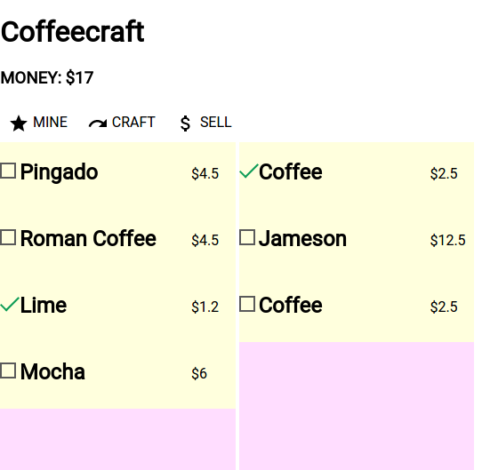
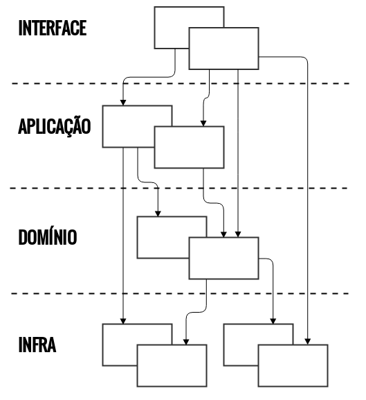
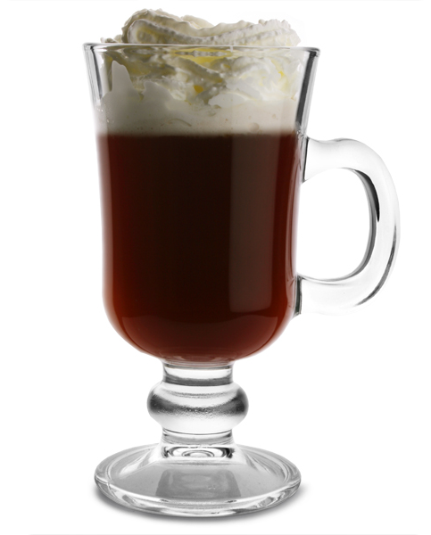

Coffeecraft: aplicação web multi-camadas em Scala e Akka
=================================================================

Geekie Tech Talk, 2015-07-08

---

## Introdução

Coffeecraft é um projeto-brinquedo, desenvolvido para experimentar
algumas tecnologias novas e antigas.
<!-- .element: style="text-align:left" -->

---

## Princípios de projeto

* **DDD** &mdash; Efetivamente separar o **modelo do domínio** do restante: banco de dados, aplicação e interface.

* Bancos relacionais são a coisa mais normal do mundo.

* Escrever adaptadores para realizar desacoplamento e "casamento de impedância". Não existe mágica.

* CRUD tem que ser fácil.

* Ser mais [_reativo_](http://www.reactivemanifesto.org/).

--

## Sistema em camadas
<!-- .element: style="text-align:left" -->

--

Em um programa orientado a objetos, é comum ver código de suporte
relativo à interface, banco e outros escrito dentro dos objetos de
negócios. Lógica de negócios adicional também acaba embutida no
comportamento de widgets de interface e scripts de acesso a
bancos. Isto ocorre porque é o jeito mais rápido e fácil de fazer tudo
funcionar, a curto prazo.

<!-- .element: style="font-size:0.8em; text-align:justify;" -->

Quando código de domínio é espalhado no meio de muito código de outros
tipos, ele se torna extremamente difícil de ver e de raciocinar a
respeito. Mudanças superficiais à interface podem alterar a lógica de
negócios. E modificar a lógica de negócios exige um rastreamento
meticuloso do código de interface, de banco e outros elementos. É
difícil implementar objetos coerentes e dirigido por modelos. Testes
automatizados ficam estranhos. Quando todas as tecnologias e lógica
estão envolvidas em cada atividade, um programa que não seja muito
simples se torna impossível de compreender.

<!-- .element: style="font-size:0.8em; text-align:justify" -->

&mdash; _Domain-Driven Design: Tackling Complexity in the Heart of
Software_,  Eric Evans (2003)

--

## Sistemas reativos
 

---

## O que temos para mostrar

* Defesa da sabedoria milenar dos bancos relacionais.

* Desenvolvimento de uma aplicação web multi-camadas.
<!-- .element: class="fragment" -->

* Utilização do modelo de atores.
<!-- .element: class="fragment" -->

* Estudar novas ferramentas de front-end: Dart e Polymer.
<!-- .element: class="fragment" -->

---

## Próximos passos

* Persistência e gerenciamento de usuários plausível.

*

---

# OBRIGADO!

<!-- In an object-oriented program, UI, database, and other support code
often gets written directly into the business objects. Additional
business logic is embedded in the behavior of UI widgets and database
scripts. This happens because it is the easiest way to make things
work, in the short run.

When the domain-related code is diffused through such a large amount
of other code, it becomes extremely difficult to see and to reason
about. Superficial changes to the UI can actually change business
logic. To change a business rule may require meticulous tracing of UI
code, database code, or other program elements. Implementing coherent,
model-driven objects becomes impractical. Automated testing is
awkward. With all the technologies and logic involved in each
activity, a program must be kept very simple or it becomes impossible
to understand. -->
